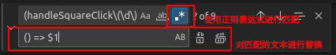

# REGEX

> [Regular-Expressions.info](https://www.regular-expressions.info)

## Basics

## Advanced

### Replacement Strings

1. Using braces to warp what you want to replace, such as `(\d+)-(\d+)-(\d+)`;
2. Using `$x` to indicate them from 1 in order, such as `$2/$3/$1`.

| Text       | Match Regex           | Replace Regex | Result     |
| ---------- | --------------------- | ------------- | ---------- |
| 2023-12-03 | `(\d+)-(\d+)-(\d+)` | `$1/$2/$3`  | 12/03/2023 |

## Usages

### Visual Studio Code

This part introduces how to use regex to replace strings.

Steps:

1. Press `Ctrl + F` to popover a search panel (or `Ctrl + Shift + F` in the right side bar to activate the search tab);
2. Input `Find` and `Replace`:
   
3. Replace it or all!
